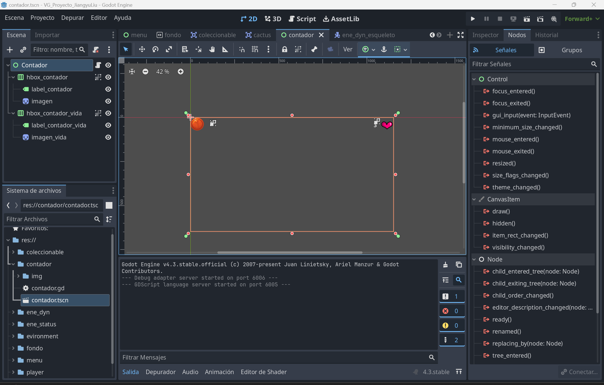
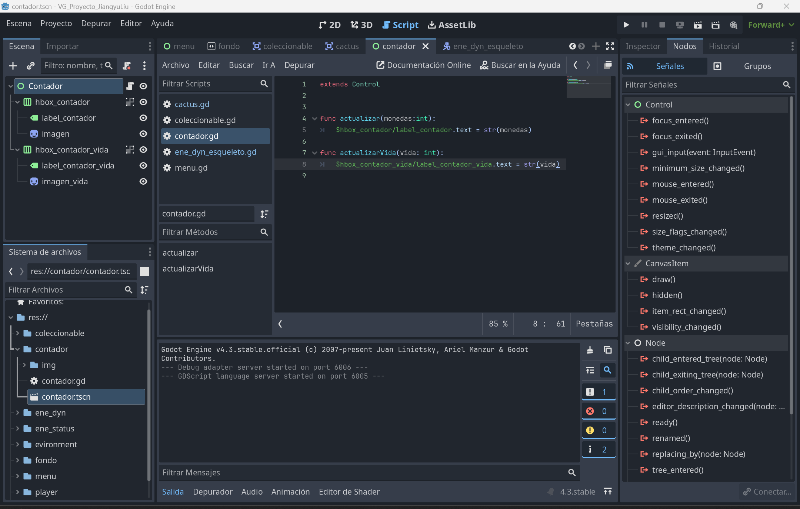
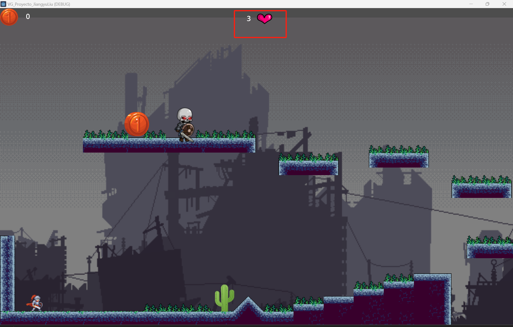
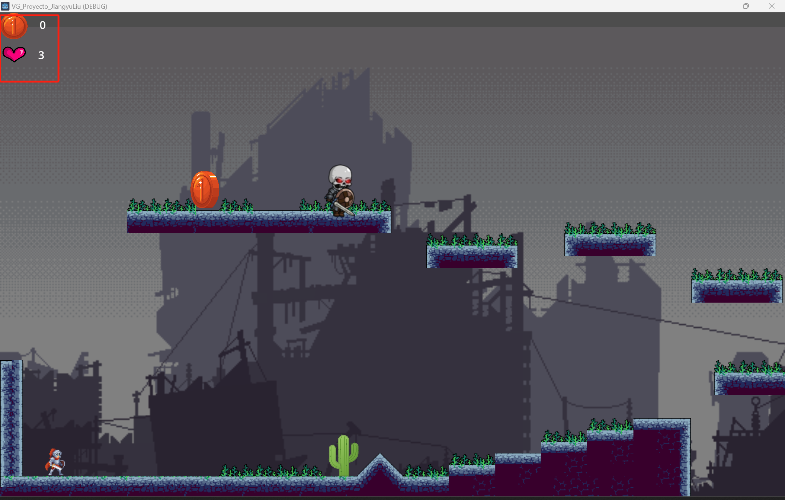

# VG_GuerreroEsqueleto

# Índice
- [Índice](#índice)
- [Introducción](#introducción)
- [Conceptualización](#conceptualización)

# Introducción
El proyecto "VG_GuerreroEsqueleto" es un juego hecho con Godot, de estilo aventura, que combina acción, exploración y narrativa en un mundo oscuro y fantasioso. El jugador encarna a Eric, un valiente caballero del Reino de la Luz, que se adentra en la temida Llanura de los Esqueletos para derrotar a un poderoso mago oscuro y liberar la tierra de una maldición ancestral.

A lo largo del desarrollo se han enfrentado diversos retos técnicos y creativos, desde la implementación del sistema de vida hasta el ajuste visual de los elementos en pantalla. Además, el proyecto hace uso de múltiples recursos externos como música, texturas y personajes, seleccionados cuidadosamente para crear una experiencia inmersiva.

Este documento presenta una visión completa del juego: su historia, las dificultades encontradas durante el desarrollo, los recursos utilizados y el enlace al repositorio del proyecto.

# Conceptualización
- **Historia del videojuego:**
    - La narrativa completa puede leerse en el siguiente archivo: [Histotia del videojuego](/Recursos/Historia.md)
- **Motor de desarrollo:**
    - Utilizado el motor Godot 4.3, que permite una programación eficiente en GDScript, además de ofrecer herramientas visuales potentes para el desarrollo de juegos 2D.
- **Música y efectos de sonido (BGM):**
    - Música seleccionada de la plataforma: [Musica o BGM](https://www.aigei.com/sound/class/games_category)
- **Texturas:**
    - Recursos visuales descargados de: [Textura](https://www.zhaozi.cn/s/all/otf/)
- **Personajes Enemigo:**
    - Personaje esqueleto obtenido desde: [Personaje Esqueleto](https://www.aigei.com/s?q=%E9%AA%B7%E9%AB%85%E5%85%B5&type=2d)
- **Otros recursos:**
    - Para completar la ambientación, se han utilizado recursos adicionales desde:
        - [itch.io](https://itch.io/)
        - [craftpix.net](https://craftpix.net/)
    - Recursos del archivo del aula virtual:
        - Moneda
        - Captus 
- **Generación de fondo mediante IA**
    - La imagen de fondo principal fue generada con inteligencia artificial.
    

# Problemas

## Dificultades con los cactus y la vida

A la hora de seguir los pasos de los apuntes, al llegar a la parte de cactus y de la vida me ha costado bastante en resolver el problema.

* Al llegar a ese apartado pienso que para mostrar moneda es lo mismo para mostrar la vida por lo tanto lo hice en la misma escena.

* En el script igual, pero a la hora de hacer la relación con el jugador me ha costado, porque los métodos eran en inglés y como se me daba muy mal inglés me ha costado entender las cosas y cómo hacer referencias.
* Pero luego ya he descubierto a lo largo de investigando y traduciendo las cosas.

* Vemos que al agrandar la pantalla el corazón de la vida no se ajusta y no he podido descubrir cómo lograrlo.

* Para que se vea bien lo he movido todo a la izquierda para que se pueda ver.